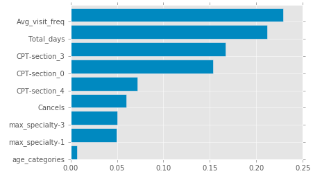

# Patient_Churn
2017 Galvanize Capstone Project

## Motivation

The motivation of this project is to predict what features best predict churn of patients in therapy.

## Data

The data used in this project was from a mental health office where their business model includes a type of therapy where patients, instead of having to come in to see a therapist, can speak to their doctors over the phone.

I received the data in three csv forms. A patient appointment csv, and a two patient billing csv, one with duplicates and one without duplicates. When comparing the two billing csv I found that the csv with duplicates had more patient entries and used that csv. I imported the csv files with pandas and turned them into dataframes.

## Features
There was a lot a could do with the data given to me.

#### 1. Most common Specialty types labled 1, 2, 3, 0 then converted to dummy variables
1- 'Psych/Mental Health'
2- 'Medical'
3- 'Child & Adolescent Psychiatry'
0- All the rest

#### 2. CPT codes grouped into 5 categories
section-1 - Phone type
section-2 - Couples therapy
section-3 - Psychotherapy with EM
section-4 - Psychotherapy
section-0 - All the rest

#### 3. Age grouped into two categories based on avg age of all patients
1 - For above 30 patients
2 - For below 30 patients

#### 4. Type of thrapy sectioned into three groups
 0 - in person appt
 1 - TelePsyche appt
 3 - Mixed

 

#### 5. Average frequency of visits
-took the total sum of days between each visit and then took the mean of those sums

#### 6. Total days as patient
-total days from the first appointment to the last appointment

#### 7. Cancels and Reschedules
  -total count of cancellations and reschedules the patient had

#### 8. Gender
0 - Male
1 - Female

The features that had significance and became my final features to model on were:
1. Total_days
2. Avg_visit_freq
3. CPT_section_0
4. CPT_section_4
5. Cancels
6. max_specialty-1
7. max_specialty-3
8. age_categories

## Models

I used a various number of classifying models including logistic regression, decision tree, random forest, adaptive boosting, and gradient boosting.

The model that had the highest area under the curve and accuracy was gradient boosting.  

I then preformed a grid search and found feature importances. The parameters used were:

best parameters: {'learning_rate': 0.1, 'min_samples_leaf': 1, 'n_estimators': 150, 'random_state': 1, 'max_features': 'sqrt', 'max_depth': 6}

## Conclusions
The features that were most likely to predict the churn of a patient were:
1. Total_days
2. Avg_visit_freq
3. CPT_section_0
4. CPT_section_3
5. CPT_section_4
6. Cancels
7. max_specialty-1
8. max_specialty-3
9. age_categories

Total_days and Avg_visit_freq may indicate churn the most because as people get well or go through a standard treatment they do not need to come back. This is a feature that could be search into deeper to find why those patients left initially.

CPT_section_0 is the CPT codes that i had grouped by as "All the rest". This is a feature that I would dive into more and break up those CPT into even smaller categories to find exactly which codes gives the highest signal.

CPT_section_3 is the CPT code of psychotherapy w/ EM. Would need further information about what EM stands for.

CPT_section_4 are the CPT codes that fall under psychotherapy which most of the patients would. I would try to find out if more of the patients under this CPT fall into phone, in_person, or mixed type.

Cancels are and indicator of churn. Those who have canceled their appointments before are at higher chances of churning. They could perhaps target patients that tend to cancel to prevent churn.

max_specialty-1 is patients that see doctors with the specialty having psyc/mental health and max_specialty-3 is those patients seeing doctors with the specialty of Child/Adolescent Psychiatry.

And finally patient age is an indicator which could be looked into further by separating ages even further and targeting different ages.

## Next Steps
Along with my conclusions about the features that best indicate churn I think getting more data and testing the model on that data would help us better understand the effectiveness of the model. Specifically knowing weather and patient churned because they had completed their treatment or did they truly churn.

Communicating with people who have gathered this data and getting more insights about patients would lead to better feature understanding and modeling.
